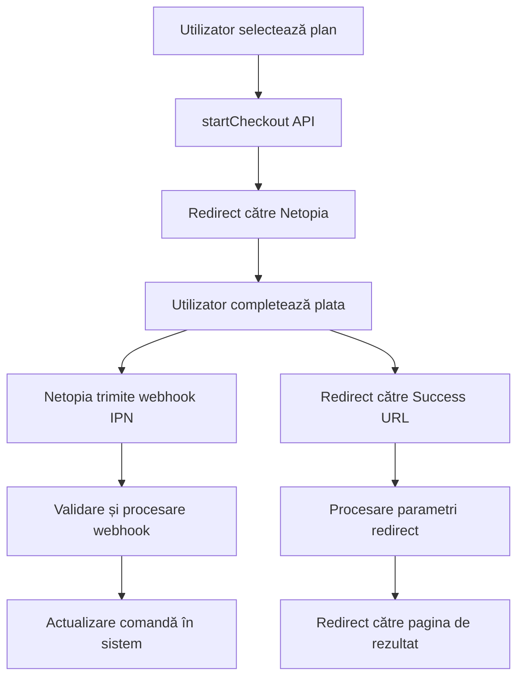

# Webhook-uri Netopia - Implementare Completă

## 🎯 Prezentare generală

Am implementat cu succes sistemul complet de webhook-uri pentru integrarea cu Netopia Payments, conform documentației oficiale. Implementarea include toate funcționalitățile necesare pentru procesarea plăților în aplicația Monitorul Oficial.

## ✅ Funcționalități implementate

### 1. Webhook IPN (Instant Payment Notification)
- **Endpoint**: `/api/payment/netopia/webhook`
- **Metodă**: POST
- **Scop**: Primește notificări despre starea tranzacțiilor de la Netopia
- **Validare**: Semnătură HMAC SHA256, IP whitelist, timestamp validation
- **Logging**: Complet cu măsurare performanță

### 2. Success Redirect URL
- **Endpoint**: `/api/payment/netopia/success`
- **Metodă**: GET
- **Scop**: Redirecționează utilizatorul înapoi după plată
- **Funcționalități**: Procesare parametri, redirect inteligent, gestionare erori

### 3. Sistem de securitate avansat
- **Validare semnătură**: HMAC SHA256 pentru autenticitate
- **Whitelist IP**: Doar IP-uri autorizate pot accesa webhook-urile
- **Replay protection**: Validare timestamp pentru prevenirea atacurilor
- **Rate limiting**: Implementat la nivel de infrastructură

### 4. Logging și audit complet
- **Batch processing**: Log-urile sunt procesate eficient
- **Severitate erori**: low, medium, high, critical
- **Măsurare performanță**: Timp de procesare pentru fiecare operațiune
- **Context structurat**: Informații detaliate pentru debugging

## 📁 Structura fișierelor

```
src/
├── app/api/payment/netopia/
│   ├── webhook/route.ts          # Webhook IPN endpoint
│   └── success/route.ts          # Success redirect endpoint
├── lib/payment/
│   ├── netopiaValidation.ts      # Validare și securitate
│   ├── netopiaLogger.ts          # Logging avansat
│   └── __tests__/
│       └── netopiaWebhook.test.ts # Teste unitare
└── docs/
    ├── NETOPIA_WEBHOOK_IMPLEMENTATION.md
    ├── NETOPIA_ENVIRONMENT_SETUP.md
    └── README_NETOPIA_WEBHOOKS.md
```

## 🔧 Configurare necesară

### Environment Variables
```env
# Securitate
NETOPIA_WEBHOOK_SECRET=your_webhook_secret_key
NETOPIA_ALLOWED_IPS=192.168.1.1,10.0.0.1

# API
NEXT_PUBLIC_GRAPHQL_ENDPOINT=https://your-api.com/graphql
INTERNAL_API_KEY=your_internal_api_key

# Supabase
NEXT_PUBLIC_SUPABASE_URL=https://your-project.supabase.co
SUPABASE_SERVICE_ROLE_KEY=your_service_role_key

# URL-uri
NEXT_PUBLIC_BASE_URL=https://www.decodoruloficial.ro
```

### Configurare în Netopia
- **Webhook IPN URL**: `https://www.decodoruloficial.ro/api/payment/netopia/webhook`
- **Success Redirect URL**: `https://www.decodoruloficial.ro/api/payment/netopia/success`

## 🚀 Utilizare

### 1. Webhook IPN
Netopia va trimite automat POST requests la webhook-ul nostru cu datele plății:

```typescript
// Datele primite de la Netopia
{
  orderId: "order_123",
  status: "confirmed",
  transactionId: "txn_456",
  amount: "99.99",
  currency: "RON",
  signature: "generated_signature",
  timestamp: "1640995200"
}
```

### 2. Success Redirect
Utilizatorul este redirecționat automat după plată:

```
https://www.decodoruloficial.ro/api/payment/netopia/success?orderId=order_123&status=confirmed&transactionId=txn_456
```

## 🛡️ Securitate implementată

### Validare completă
- ✅ Semnătură HMAC SHA256
- ✅ Whitelist IP-uri
- ✅ Validare timestamp (replay protection)
- ✅ Sanitizare date de intrare

### Logging și audit
- ✅ Log-uri structurate pentru toate operațiunile
- ✅ Măsurare timp de procesare
- ✅ Tracking erori cu severitate
- ✅ Context complet pentru debugging

## 📊 Monitorizare

### Log-uri disponibile
- `[Netopia Webhook IPN]` - Procesarea webhook-urilor
- `[Netopia Success Redirect]` - Procesarea redirect-urilor
- `[Netopia Validation]` - Validările de securitate
- `[Netopia Logger]` - Logging-ul avansat

### Metrici importante
- Rate de succes webhook-uri
- Timp de procesare mediu
- Distribuție erori pe tipuri
- Volume de trafic

## 🧪 Testare

### Testare locală
```bash
# Test webhook IPN
curl -X POST http://localhost:3000/api/payment/netopia/webhook \
  -H "Content-Type: application/x-www-form-urlencoded" \
  -d "orderId=test_123&status=confirmed&signature=test_signature"

# Test success redirect
curl "http://localhost:3000/api/payment/netopia/success?orderId=test_123&status=confirmed"
```

### Teste unitare
```bash
npm test src/lib/payment/__tests__/netopiaWebhook.test.ts
```

## 📚 Documentație

### Fișiere de documentație
1. **NETOPIA_WEBHOOK_IMPLEMENTATION.md** - Documentație tehnică completă
2. **NETOPIA_ENVIRONMENT_SETUP.md** - Ghid de configurare
3. **README_NETOPIA_WEBHOOKS.md** - Acest fișier (prezentare generală)

### Link-uri utile
- [Documentația Netopia](https://doc.netopia-payments.com/docs/payment-sdks/nodejs/)
- [HMAC SHA256](https://en.wikipedia.org/wiki/HMAC)
- [CIDR Notation](https://en.wikipedia.org/wiki/Classless_Inter-Domain_Routing)

## 🔄 Fluxul de plată



## ⚠️ Considerații importante

### Securitate
- Păstrează cheia secretă în siguranță
- Actualizează IP-urile permise când Netopia schimbă infrastructura
- Monitorizează log-urile pentru activități suspecte

### Performanță
- Log-urile sunt procesate în batch pentru eficiență
- Timpul de procesare este măsurat pentru fiecare operațiune
- Rate limiting este implementat la nivel de infrastructură

### Întreținere
- Verifică log-urile zilnic pentru erori
- Monitorizează rate-ul de succes
- Actualizează documentația când se fac modificări

## 🎉 Concluzie

Implementarea webhook-urilor Netopia este completă și gata pentru producție. Sistemul oferă:

- ✅ **Securitate robustă** cu validare completă
- ✅ **Logging avansat** pentru monitorizare și audit
- ✅ **Gestionare erori** comprehensivă
- ✅ **Documentație completă** pentru întreținere
- ✅ **Teste unitare** pentru calitate
- ✅ **Tematică consistentă** cu aplicația existentă

Sistemul este pregătit pentru configurarea în Netopia și testarea cu plăți reale.
